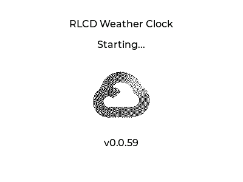
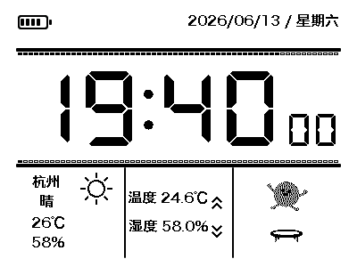
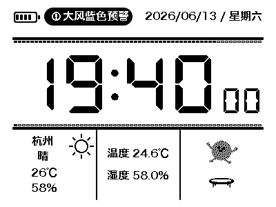
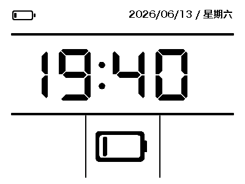
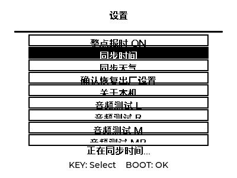
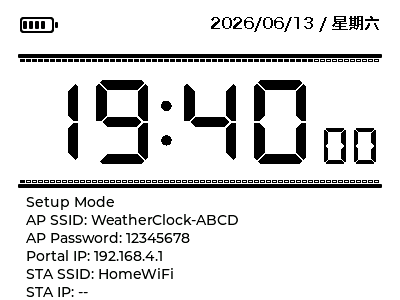

# ESP32-S3 RLCD 天气时钟

这是一个基于 Waveshare ESP32-S3-RLCD-4.2 开发板的低功耗天气时钟项目。当前主固件工程仍保留在 `RLCD_CLOCK/` 目录中，仓库根目录用于放置项目说明、硬件资料、示例代码和后续会用到的资源文件。

## 硬件与技术栈

- 主控：ESP32-S3，16 MB Flash，带 PSRAM。
- 屏幕：4.2 英寸 RLCD 反射式 LCD。
- UI：LVGL 8，支持 `RLCD_CLOCK/simulator/` 下的 SDL 本地预览。
- RTC：PCF85063，通过 I2C 通信。
- 本地传感器：SHTC3，通过 I2C 读取温度和湿度。
- 电池检测：ADC1 Channel 3 采样，按 3 倍分压换算电池电压。
- 天气服务：和风天气 QWeather，使用 API Key 认证，请求头为 `X-QW-Api-Key`。
- 时间同步：NTP，服务器包括 `pool.ntp.org`、`ntp.aliyun.com`、`time.windows.com`。

## 固件功能逻辑

- 开机后显示启动页，包含项目名称、版本号、启动状态和 GIF 抽帧动画。
- 如果已经保存 WiFi 信息，开机后会连接 WiFi，并进行一次 NTP 时间同步和天气同步。
- 如果没有 WiFi 信息，设备会进入配网模式，AP 名称格式为 `WeatherClock-XXXX`。
- 配网方式：连接设备 AP 后打开 `192.168.4.1`，输入 WiFi 名称、WiFi 密码和 QWeather API Key。
- NTP 同步规则：开机同步一次，之后每天 0 点同步一次。
- 天气同步规则：开机或首次配网成功后同步一次，之后每小时同步一次。
- 天气预警同步规则：与实时天气共用 API Key 和每小时同步周期；低电量极简模式下跳过预警请求。
- 本地温湿度读取规则：每分钟读取一次。
- 电池读取规则：每 5 分钟读取一次电池百分比和电池电压。
- 低功耗策略：非联网同步时间窗口会主动关闭 WiFi；CPU 降频并启用 light sleep，同时保持 RLCD 屏幕显示。

## 主界面显示

- 时间使用断码屏风格的大号数字显示，小时和分钟最大，秒显示较小。
- 日期显示在右上角，格式为 `YYYY/MM/DD / 星期几`。
- 电池图标显示在左上角，内部 5 个小格，每格代表约 20% 电量。
- 城市、网络天气、本地温度和本地湿度显示在主界面下方区域。
- 当天气 API 返回有效预警时，顶部空白区域会显示黑底白字的椭圆预警条，并按秒闪烁；无预警时该区域保持空白。
- 当电池电量低于 5% 时，进入低电量极简模式：隐藏秒、小进度条、天气、本地温湿度和 GIF 动画，只保留分钟级时间、日期、电池和底部中间的低电量提醒图标；电量恢复到 8% 以上后返回正常工作界面。
- 正常工作界面不显示 `WiFi OFF`、`AP OFF`、`NTP OK` 等状态文字，避免干扰主要信息。
- 进入配网模式时，底部三等分信息栏会临时隐藏，改为显示设备 AP、AP 密码、门户地址、当前保存的 WiFi 和 STA IP 状态；配网完成后恢复正常三格信息。
- 中文 UI 使用生成的 LVGL 字体，当前字体来源为 `Hiragino Sans GB W6 Bold`，尺寸为 16 px，1 bpp，适配单色 RLCD 显示链路。
- 天气图标使用 QWeather 图标字体转换后的 LVGL 字体。

## 页面预览

页面预览图由 `scripts/generate_previews.sh` 通过 LVGL SDL 模拟器生成。只有 UI 页面发生变化时才需要更新这些图片；完整发版脚本会在 SDL 编译后自动刷新预览。

启动页：

主工作界面：

天气预警状态：

低电量极简模式：

设置页面：

配网状态界面：

## KEY 设置页面

KEY 键位于 GPIO18，低电平按下。当前设置页面逻辑如下：

- 长按 KEY 2 秒：进入设置页面。
- 设置页面 5 秒无操作：自动返回正常工作界面。
- 设置页面内短按 KEY：循环选择下一项。
- 设置页面内短按 BOOT：确认当前选项。

设置页面包含 4 个项目：

- `整点报时`：切换 ON/OFF，并保存到 NVS。当前版本已完成开关、持久化和整点触发判断；实际音频播放入口已预留，后续接入 ES8311/I2S 音频驱动。
- `同步时间`：立即请求一次 NTP 同步，由后台网络任务打开 WiFi 并完成同步。
- `同步天气`：立即请求一次 QWeather 实时天气同步，由后台网络任务处理。
- `恢复出厂设置`：清除已保存的 WiFi 与 API Key，并进入配网模式。

## Boot 键信息页

BOOT 键用于查看系统信息和进入配网模式：

- 按住不足 5 秒：界面不变化。
- 按住 5 到 19 秒：显示英文信息页。
- 未满 20 秒松手：返回正常时钟主界面。
- 按住 20 秒以上：进入配网模式。

信息页只使用英文和数字，显示内容包括：

- 上一次 NTP 同步时间。
- 当前保存的 WiFi SSID。
- 上一次天气 API 查询时间。
- 电池百分比和电池电压。
- 当前软件版本号。

## 项目目录结构

- `RLCD_CLOCK/`：当前主工程目录，包含 ESP-IDF 固件、组件、配置文件和 SDL 预览工程。
- `RLCD_CLOCK/main/`：天气时钟应用主体代码、字体资源、天气图标字体和开机动画抽帧资源。
- `RLCD_CLOCK/components/`：板级 BSP、显示驱动、I2C、传感器和厂商依赖组件。
- `RLCD_CLOCK/managed_components/`：ESP-IDF 管理的第三方组件，目前主要是 LVGL。
- `RLCD_CLOCK/simulator/`：LVGL SDL 本地预览工程，用于在烧录前检查界面效果。
- `docs/`：原理图、芯片手册、传感器资料和其他硬件文档。
- `examples/esp-idf/`：厂商提供的 ESP-IDF 示例工程，作为硬件驱动和外设逻辑参考。
- `assets/weather-icons/`：和风天气图标 SVG、字体和源文件。
- `assets/gif_video/`：后续 UI 或媒体功能可能会使用的 GIF 和音频资源。
- `scripts/`：项目辅助脚本，目前包含 Gitea Release 发布脚本。
- `README.md`：项目说明、功能逻辑、目录结构和版本记录。

## 发布与下载

每个正式测试版本都会同步 Git 标签，并在 Gitea Release 中上传编译好的固件产物，方便直接下载测试。

Release 附件包括：

- `weather_clock_vX.X.X.bin`：App 固件。
- `weather_clock_vX.X.X_flash_package.zip`：包含 bootloader、分区表、App 固件、`flash_args` 和简短烧录说明。
- `weather_clock_vX.X.X_merged.bin`：合并后的完整镜像，适合需要整包写入时使用。

发布附件上传脚本为 `scripts/publish_gitea_release.sh`。完整发版脚本为 `scripts/release_version.sh`，会依次执行固件编译、SDL 模拟器编译、代码检查、提交、打标签、推送和上传 Release 附件。脚本不会保存账号密码，需要运行时提供 `GITEA_TOKEN`，或者提供 `GITEA_USER` 和 `GITEA_PASSWORD`。

## 版本记录

- `v0.0.59`：微调顶部天气预警条位置，将预警提示整体右移并略微缩短，避免遮挡左上角电池图标，同时保持与右上角日期之间的留白。
- `v0.0.58`：优化 RLCD 刷新路径，LVGL flush 不再默认整屏发送，而是合并脏区域的横向范围并刷新对应条带，页面切换和大面积变化仍走整屏刷新；新增低电量极简模式，电量低于 5% 时停止天气/预警、本地温湿度、GIF、秒显示和进度条，只保留分钟级基础信息和低电量图标；新增 QWeather 天气预警查询与顶部闪烁预警条；将 `电量不足.svg` 和 `警告.svg` 转为固件内置 1-bit 位图，并为 SDL 预览增加预警和低电量页面截图。
- `v0.0.57`：继续推进低风险功耗优化；BOOT/KEY 按键轮询改为自适应节奏，普通工作页无按键时降低唤醒频率，按下、设置页、信息页和配网状态保持更快响应；电池 ADC 改为采样时初始化、采样后释放，避免 5 分钟采样间隔外长期占用 ADC；FreeRTOS tick 从 1000Hz 降到 250Hz，减少空闲调度开销；保持 1-bit 显示链路、GPIO 唤醒和 Light Sleep 大改暂不引入。
- `v0.0.56`：继续做低风险功耗优化；修复 SHTC3 温湿度传感器成功读取后未执行 sleep 的问题；housekeeping 任务改为睡到下一次传感器或电池采样，减少空闲唤醒；主工作页仅在秒、状态、电池、天气或页面切换变化时强制刷新；LVGL port 空闲最小 delay 从 100ms 提高到 250ms；正式测试配置将默认日志级别降为 WARN。
- `v0.0.55`：进一步优化 LVGL 显示缓冲；真机端显示 draw buffer 从 400×300 全屏双缓冲改为 40 行双缓冲，显著降低运行时 PSRAM/RAM 占用，同时保留现有 16-bit 渲染和 RLCD flush 转换逻辑，避免直接切 1-bit 引入字体、图标和反色显示风险。
- `v0.0.54`：执行第一批低风险低功耗与性能优化；主界面、Boot 信息页和设置页改为保留 LVGL 对象并通过隐藏/显示切换，减少页面返回时的销毁重建；BOOT/KEY 按键轮询合并为单个任务，传感器和电池采样合并为 housekeeping 任务；非配网 WiFi 同步阶段改用 `WIFI_PS_MAX_MODEM`；保持 1-bit 显示链路和 Light Sleep 作为后续独立实验，不混入正式版。
- `v0.0.53`：设置页“恢复出厂设置”的二次确认文案改为“确认恢复出厂设置”；手动同步时间和同步天气时，设置页会保持停留并显示进行中状态，完成后显示成功或失败，再按正常无操作逻辑返回主界面；手动同步增加 60 秒超时处理，避免网络异常时长时间卡在设置页。
- `v0.0.52`：将上下 60 格进度条从 60 个 LVGL 对象改为单个 canvas 绘制，并在正常走秒时只局部刷新变化的小格；设置页同步时间和同步天气增加进行中、完成、失败反馈；恢复出厂设置改为二次确认；README 增加页面预览截图，并将预览图生成纳入自动发版脚本。
- `v0.0.51`：优化天气 API 信息栏排版，将天气文字、温度和湿度拆分为独立标签并居中对齐；降低每秒 UI 刷新负载，秒进度条改为只更新变化的格子，GIF 动画改为差分绘制；主 UI 刷新改为按下一秒边界调度，避免固定延时累积导致秒数跳动；KEY 轮询频率降低以减少空闲唤醒。
- `v0.0.50`：新增 KEY 长按 2 秒进入设置页面，支持整点报时开关、手动同步时间、手动同步天气和恢复出厂设置；设置页 5 秒无操作自动返回主界面；配网模式下底部三格临时切换为 AP SSID、AP 密码、门户 IP、STA SSID 和 STA IP 状态显示；SDL 模拟器新增设置页和配网状态预览模式。
- `v0.0.49`：优化主界面天气栏排版，天气图标移动到 API 信息栏右上角，城市、天气、温度和湿度文字按同一中心线对齐；在时间区域上分割线下方增加 60 个一天进度矩形，在下分割线上方增加 60 个秒进度矩形，分别按当天进度和当前秒数填充。
- `v0.0.48`：主界面时间下方区域改为三等分信息栏，并用实线分隔；第一栏显示天气 API 信息和天气图标，第二栏显示本地温湿度，第三栏显示从指定 GIF 等距抽取的 60 帧动画，动画按当前秒数每秒切换一帧；GIF 转换改为色彩映射加抖动点阵，保留卡通人物脸部细节，并优化天气栏和本地温湿度的居中对齐。
- `v0.0.47`：修复 RTC 异常年份导致主界面显示 2092 年的问题；启动时会拒绝明显不合理的 RTC 时间，NTP 必须等待 SNTP 真正同步完成后才写回 RTC；新增一键发版脚本，串联编译、提交、标签、推送和 Gitea Release 附件上传。
- `v0.0.46`：修复启动页天气预取在 main 任务中导致栈溢出重启的问题；启动天气同步改为独立任务并复用开机动画时间，启动收尾直接跳到 GIF 最后一帧，避免逐帧补播造成开机页停留过久；屏幕初始化后立即清白屏，减少 RLCD 残留主界面闪现。
- `v0.0.45`：启动页优先预取天气 API，天气最多等待 6 秒；成功后进入主界面即显示天气，超时则进入主界面后后台继续同步。
- `v0.0.44`：启动页联网同步加入 6 秒预算；天气 API 会在启动页内优先加载，超时则进入主界面后后台继续同步。
- `v0.0.43`：开机动画改为联网阶段慢速播放、启动完成后快速收尾；主界面将“本地”改为“温度”，并移除城市名前缀。
- `v0.0.42`：保持开机 GIF 96 帧不变，将播放间隔从 50ms 缩短到 25ms，并压缩 SDL 开机页总时长。
- `v0.0.41`：将开机 GIF 抽帧数量从 32 帧提升到 96 帧，并将播放间隔缩短到约 50ms，让动画过渡更连续。
- `v0.0.40`：开机 GIF 在启动结束时会从当前帧继续播放到最后一帧，并保持最后一帧 0.1 秒后再进入主界面。
- `v0.0.39`：将开机 GIF 改为全帧连续循环播放，启动信息正常更新，启动完成后保留开机页约 2.5 秒并确保至少覆盖一轮动画。
- `v0.0.38`：删除 README 中的编译烧录命令，补充项目目录结构说明，并将开机 GIF 改为启动页期间连续播放。
- `v0.0.37`：将开机页原进度条替换为 GIF 抽帧动画，动画按启动百分比播放一个完整周期，并上移标题、状态和版本文字以避免遮挡。
- `v0.0.36`：调整主界面布局，电池图标移到左上角，日期和星期合并到右上角，移除底部 WiFi/AP/NTP 状态文字，并修复 Boot 信息页返回主界面后电池图标偶发空白的问题。
- `v0.0.35`：新增 BOOT 键信息页，记录上一次 NTP/天气同步时间和电池电压，整理仓库资料、示例和资源目录，并新增 README。
- `v0.0.34`：恢复中文字体可见性，将中文 LVGL 字体切回 1 bpp，同时保留较粗的字体来源。
- `v0.0.33`：天气城市显示改为 IP 定位得到的城市，避免显示更细的区县名称。
- `v0.0.32`：将天气响应缓冲区移出同步任务栈，并增大网络同步任务栈。
- `v0.0.31`：支持处理 gzip 压缩的天气 API 响应。
- `v0.0.30`：修复电池电量读取，改为使用 ADC 电压采样计算。
